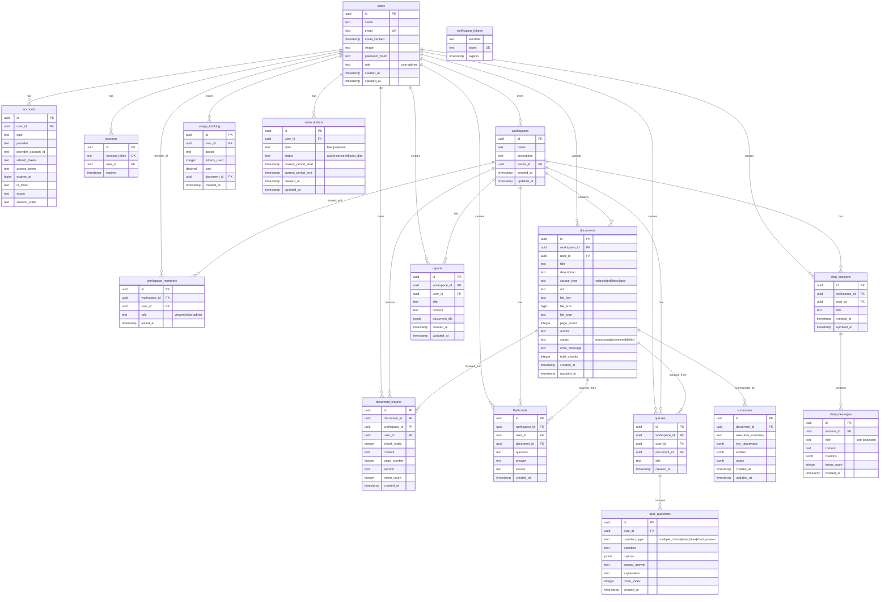

# AI Knowledge Workspace - Design Document

## 1. Architecture Overview

```
┌─────────────────────────────────────────────────────────────────────┐
│                        Next.js 15 Application                        │
│  ┌──────────┐  ┌──────────┐  ┌──────────┐  ┌──────────────────┐   │
│  │  Auth UI  │  │Workspace │  │  Chat UI │  │ Document Library │   │
│  │ (Auth.js) │  │    UI    │  │ (Stream) │  │    (CRUD)        │   │
│  └──────────┘  └──────────┘  └──────────┘  └──────────────────┘   │
│  ┌──────────────────────────────────────────────────────────────┐   │
│  │                    Route Handlers / Server Actions             │   │
│  └──────────────────────────────────────────────────────────────┘   │
└─────────────────────────────────────────────────────────────────────┘
                                    │
        ┌───────────────────────────┼───────────────────────────┐
        ▼                           ▼                           ▼
┌───────────────┐    ┌───────────────────────┐    ┌───────────────────┐
│  RAG Pipeline │    │   Document Processing  │    │  Auth.js (Next)   │
│  (LangGraph)  │    │      Pipeline          │    │  - Credentials    │
│               │    │                        │    │  - Google OAuth   │
│  Query →      │    │  Upload → Extract →    │    │  - Sessions       │
│  Rewrite →    │    │  Chunk → Embed →       │    └───────────────────┘
│  Hybrid →     │    │  Store                  │
│  Rerank →     │    └───────────────────────┘
│  Generate →   │
│  Cite         │
└───────────────┘
        │                           │                           │
        ▼                           ▼                           ▼
┌──────────┐  ┌──────────┐  ┌──────────┐  ┌──────────┐  ┌──────────┐
│PostgreSQL │  │  Qdrant  │  │Cloudflare│  │   Redis  │  │  Gemini  │
│(Neon)     │  │ (Vector) │  │   R2     │  │  (Cache) │  │ 2.5 Flash│
│- Users    │  │- Vectors │  │- PDF     │  │- Sessions│  │ (LLM)    │
│- Workspace│  │- Metadata│  │- DOCX    │  │- Rate    │  └──────────┘
│- Docs     │  └──────────┘  │- PPTX    │  │  Limiting│
│- Chats    │                 │- Images  │  └──────────┘
│- Flashcards│                └──────────┘
│- Quizzes   │
│- Reports   │
│- Usage     │
└──────────┘
```

## 2. Folder Structure

```
src/
├── app/
│   ├── (auth)/
│   │   ├── login/
│   │   │   └── page.tsx
│   │   ├── register/
│   │   │   └── page.tsx
│   │   └── layout.tsx
│   ├── (dashboard)/
│   │   ├── layout.tsx
│   │   ├── page.tsx                    # Dashboard home
│   │   ├── workspace/
│   │   │   ├── [workspaceId]/
│   │   │   │   ├── page.tsx           # Workspace view
│   │   │   │   ├── documents/
│   │   │   │   │   └── page.tsx
│   │   │   │   ├── chat/
│   │   │   │   │   └── page.tsx
│   │   │   │   ├── flashcards/
│   │   │   │   │   └── page.tsx
│   │   │   │   ├── quizzes/
│   │   │   │   │   └── page.tsx
│   │   │   │   └── reports/
│   │   │   │       └── page.tsx
│   │   │   └── new/page.tsx
│   │   ├── admin/
│   │   │   └── page.tsx
│   │   └── settings/
│   │       └── page.tsx
│   ├── api/
│   │   ├── auth/
│   │   │   └── [...nextauth]/
│   │   │       └── route.ts
│   │   ├── workspace/
│   │   │   ├── route.ts
│   │   │   └── [workspaceId]/
│   │   │       ├── route.ts
│   │   │       ├── ingest/
│   │   │       │   └── route.ts
│   │   │       ├── chat/
│   │   │       │   └── route.ts
│   │   │       ├── documents/
│   │   │       │   └── route.ts
│   │   │       ├── flashcards/
│   │   │       │   └── route.ts
│   │   │       ├── quizzes/
│   │   │       │   └── route.ts
│   │   │       └── reports/
│   │   │           └── route.ts
│   │   ├── upload/
│   │   │   └── route.ts
│   │   ├── search/
│   │   │   └── route.ts
│   │   └── admin/
│   │       └── route.ts
│   ├── layout.tsx
│   └── globals.css
├── components/
│   ├── ui/                           # shadcn components
│   ├── auth/
│   │   ├── LoginForm.tsx
│   │   ├── RegisterForm.tsx
│   │   └── AuthButton.tsx
│   ├── workspace/
│   │   ├── WorkspaceCard.tsx
│   │   ├── WorkspaceList.tsx
│   │   ├── CreateWorkspaceDialog.tsx
│   │   └── WorkspaceSettings.tsx
│   ├── chat/
│   │   ├── ChatWindow.tsx
│   │   ├── ChatInput.tsx
│   │   ├── ChatMessage.tsx
│   │   ├── ChatHistory.tsx
│   │   ├── CitationBadge.tsx
│   │   └── StreamingMessage.tsx
│   ├── documents/
│   │   ├── DocumentList.tsx
│   │   ├── DocumentCard.tsx
│   │   ├── UploadDialog.tsx
│   │   ├── IngestUrlDialog.tsx
│   │   └── ProcessingStatus.tsx
│   ├── flashcards/
│   │   ├── FlashcardDeck.tsx
│   │   └── FlashcardItem.tsx
│   ├── quizzes/
│   │   ├── QuizView.tsx
│   │   └── QuizQuestion.tsx
│   ├── reports/
│   │   ├── ReportView.tsx
│   │   └── ReportExport.tsx
│   ├── admin/
│   │   ├── StatsCard.tsx
│   │   └── UsageChart.tsx
│   └── shared/
│       ├── Sidebar.tsx
│       ├── Header.tsx
│       ├── SearchBar.tsx
│       ├── LoadingSpinner.tsx
│       └── EmptyState.tsx
├── lib/
│   ├── db/
│   │   ├── index.ts                  # DB connection
│   │   ├── schema.ts                 # Drizzle schema
│   │   └── migrations/
│   ├── auth/
│   │   ├── auth.ts                   # Auth.js config
│   │   └── middleware.ts
│   ├── validations/
│   │   ├── workspace.ts
│   │   ├── document.ts
│   │   ├── chat.ts
│   │   └── auth.ts
│   └── utils.ts
├── services/
│   ├── ingestion/
│   │   ├── index.ts                  # Orchestrator
│   │   ├── website.ts                # Website fetcher + cleaner
│   │   ├── pdf.ts                    # PDF extractor
│   │   ├── docx.ts                   # DOCX extractor
│   │   ├── pptx.ts                   # PPTX extractor
│   │   └── cleaner.ts               # HTML content cleaner
│   ├── embeddings/
│   │   ├── index.ts                  # Abstracted provider
│   │   ├── jina.ts                   # Jina Embeddings
│   │   └── bge.ts                    # BGE-M3 (future)
│   ├── chunking/
│   │   ├── index.ts                  # Chunking orchestrator
│   │   ├── recursive.ts             # Recursive chunking
│   │   └── semantic.ts              # Semantic chunking
│   ├── vector-store/
│   │   ├── index.ts                  # Abstracted vector store
│   │   ├── qdrant.ts                # Qdrant implementation
│   │   └── types.ts
│   ├── retrieval/
│   │   ├── index.ts                  # Hybrid retrieval
│   │   ├── vector.ts                # Vector search
│   │   └── keyword.ts               # Keyword search (BM25)
│   ├── reranking/
│   │   ├── index.ts
│   │   └── cross-encoder.ts
│   ├── llm/
│   │   ├── index.ts                  # LLM abstraction
│   │   ├── gemini.ts                # Gemini 2.5 Flash
│   │   └── prompts.ts               # System prompts
│   ├── citations/
│   │   ├── index.ts
│   │   └── formatter.ts
│   ├── rag/
│   │   ├── pipeline.ts              # LangGraph pipeline
│   │   └── graph.ts                 # Graph definition
│   ├── chat/
│   │   ├── index.ts                  # Chat service
│   │   └── history.ts               # Message history
│   ├── workspaces/
│   │   ├── index.ts                  # Workspace CRUD
│   │   └── sharing.ts               # Future sharing
│   ├── documents/
│   │   ├── index.ts                  # Document CRUD
│   │   └── storage.ts              # R2 file storage
│   ├── summaries/
│   │   ├── index.ts
│   │   └── generator.ts
│   ├── flashcards/
│   │   ├── index.ts
│   │   └── generator.ts
│   ├── quizzes/
│   │   ├── index.ts
│   │   └── generator.ts
│   ├── reports/
│   │   ├── index.ts
│   │   └── generator.ts
│   ├── search/
│   │   └── index.ts                 # Global search
│   ├── admin/
│   │   └── index.ts                 # Admin stats
│   └── monitoring/
│       ├── logger.ts
│       ├── metrics.ts
│       └── tracing.ts
├── middleware.ts
└── server.ts (optional)
```

## 3. Database Schema (PostgreSQL + Drizzle ORM)

### Entity-Relationship Diagram



### SQL Schema

```sql
-- Users table
CREATE TABLE users (
  id UUID PRIMARY KEY DEFAULT gen_random_uuid(),
  name TEXT,
  email TEXT UNIQUE NOT NULL,
  email_verified TIMESTAMP,
  image TEXT,
  password_hash TEXT, -- for email/password auth
  role TEXT DEFAULT 'user', -- 'user' | 'admin'
  created_at TIMESTAMP DEFAULT NOW(),
  updated_at TIMESTAMP DEFAULT NOW()
);

-- Auth.js accounts (for OAuth)
CREATE TABLE accounts (
  id UUID PRIMARY KEY DEFAULT gen_random_uuid(),
  user_id UUID NOT NULL REFERENCES users(id) ON DELETE CASCADE,
  type TEXT NOT NULL,
  provider TEXT NOT NULL,
  provider_account_id TEXT NOT NULL,
  refresh_token TEXT,
  access_token TEXT,
  expires_at BIGINT,
  id_token TEXT,
  scope TEXT,
  session_state TEXT,
  UNIQUE(provider, provider_account_id)
);

-- Auth.js sessions
CREATE TABLE sessions (
  id UUID PRIMARY KEY DEFAULT gen_random_uuid(),
  session_token TEXT UNIQUE NOT NULL,
  user_id UUID NOT NULL REFERENCES users(id) ON DELETE CASCADE,
  expires TIMESTAMP NOT NULL
);

-- Verification tokens (for email auth)
CREATE TABLE verification_tokens (
  identifier TEXT NOT NULL,
  token TEXT UNIQUE NOT NULL,
  expires TIMESTAMP NOT NULL,
  UNIQUE(identifier, token)
);

-- Workspaces
CREATE TABLE workspaces (
  id UUID PRIMARY KEY DEFAULT gen_random_uuid(),
  name TEXT NOT NULL,
  description TEXT,
  owner_id UUID NOT NULL REFERENCES users(id) ON DELETE CASCADE,
  created_at TIMESTAMP DEFAULT NOW(),
  updated_at TIMESTAMP DEFAULT NOW()
);

-- Workspace members (for future sharing)
CREATE TABLE workspace_members (
  id UUID PRIMARY KEY DEFAULT gen_random_uuid(),
  workspace_id UUID NOT NULL REFERENCES workspaces(id) ON DELETE CASCADE,
  user_id UUID NOT NULL REFERENCES users(id) ON DELETE CASCADE,
  role TEXT DEFAULT 'editor', -- 'viewer' | 'editor' | 'admin'
  joined_at TIMESTAMP DEFAULT NOW(),
  UNIQUE(workspace_id, user_id)
);

-- Documents (files + websites)
CREATE TABLE documents (
  id UUID PRIMARY KEY DEFAULT gen_random_uuid(),
  workspace_id UUID NOT NULL REFERENCES workspaces(id) ON DELETE CASCADE,
  user_id UUID NOT NULL REFERENCES users(id) ON DELETE CASCADE,
  title TEXT NOT NULL,
  description TEXT,
  source_type TEXT NOT NULL, -- 'website' | 'pdf' | 'docx' | 'pptx'
  url TEXT, -- for websites
  file_key TEXT, -- R2 object key for files
  file_size BIGINT,
  file_type TEXT, -- mime type
  page_count INTEGER,
  author TEXT,
  status TEXT DEFAULT 'processing', -- 'processing' | 'processed' | 'failed'
  error_message TEXT,
  total_chunks INTEGER,
  created_at TIMESTAMP DEFAULT NOW(),
  updated_at TIMESTAMP DEFAULT NOW()
);

-- Document chunks
CREATE TABLE document_chunks (
  id UUID PRIMARY KEY DEFAULT gen_random_uuid(),
  document_id UUID NOT NULL REFERENCES documents(id) ON DELETE CASCADE,
  workspace_id UUID NOT NULL REFERENCES workspaces(id) ON DELETE CASCADE,
  user_id UUID NOT NULL REFERENCES users(id) ON DELETE CASCADE,
  chunk_index INTEGER NOT NULL,
  content TEXT NOT NULL,
  page_number INTEGER,
  section TEXT,
  token_count INTEGER,
  created_at TIMESTAMP DEFAULT NOW()
);

-- Chat sessions
CREATE TABLE chat_sessions (
  id UUID PRIMARY KEY DEFAULT gen_random_uuid(),
  workspace_id UUID NOT NULL REFERENCES workspaces(id) ON DELETE CASCADE,
  user_id UUID NOT NULL REFERENCES users(id) ON DELETE CASCADE,
  title TEXT,
  created_at TIMESTAMP DEFAULT NOW(),
  updated_at TIMESTAMP DEFAULT NOW()
);

-- Chat messages
CREATE TABLE chat_messages (
  id UUID PRIMARY KEY DEFAULT gen_random_uuid(),
  session_id UUID NOT NULL REFERENCES chat_sessions(id) ON DELETE CASCADE,
  role TEXT NOT NULL, -- 'user' | 'assistant'
  content TEXT NOT NULL,
  citations JSONB, -- array of citation objects
  token_count INTEGER,
  created_at TIMESTAMP DEFAULT NOW()
);

-- Summaries
CREATE TABLE summaries (
  id UUID PRIMARY KEY DEFAULT gen_random_uuid(),
  document_id UUID NOT NULL REFERENCES documents(id) ON DELETE CASCADE,
  executive_summary TEXT,
  key_takeaways JSONB,
  entities JSONB,
  topics JSONB,
  created_at TIMESTAMP DEFAULT NOW(),
  updated_at TIMESTAMP DEFAULT NOW()
);

-- Flashcards
CREATE TABLE flashcards (
  id UUID PRIMARY KEY DEFAULT gen_random_uuid(),
  workspace_id UUID NOT NULL REFERENCES workspaces(id) ON DELETE CASCADE,
  user_id UUID NOT NULL REFERENCES users(id) ON DELETE CASCADE,
  document_id UUID REFERENCES documents(id) ON DELETE SET NULL,
  question TEXT NOT NULL,
  answer TEXT NOT NULL,
  source TEXT,
  created_at TIMESTAMP DEFAULT NOW()
);

-- Quizzes
CREATE TABLE quizzes (
  id UUID PRIMARY KEY DEFAULT gen_random_uuid(),
  workspace_id UUID NOT NULL REFERENCES workspaces(id) ON DELETE CASCADE,
  user_id UUID NOT NULL REFERENCES users(id) ON DELETE CASCADE,
  document_id UUID REFERENCES documents(id) ON DELETE SET NULL,
  title TEXT,
  created_at TIMESTAMP DEFAULT NOW()
);

-- Quiz questions
CREATE TABLE quiz_questions (
  id UUID PRIMARY KEY DEFAULT gen_random_uuid(),
  quiz_id UUID NOT NULL REFERENCES quizzes(id) ON DELETE CASCADE,
  question_type TEXT NOT NULL, -- 'multiple_choice' | 'true_false' | 'short_answer'
  question TEXT NOT NULL,
  options JSONB, -- for multiple choice
  correct_answer TEXT NOT NULL,
  explanation TEXT,
  order_index INTEGER,
  created_at TIMESTAMP DEFAULT NOW()
);

-- Reports
CREATE TABLE reports (
  id UUID PRIMARY KEY DEFAULT gen_random_uuid(),
  workspace_id UUID NOT NULL REFERENCES workspaces(id) ON DELETE CASCADE,
  user_id UUID NOT NULL REFERENCES users(id) ON DELETE CASCADE,
  title TEXT NOT NULL,
  content TEXT NOT NULL, -- markdown
  document_ids JSONB, -- array of document IDs used
  created_at TIMESTAMP DEFAULT NOW(),
  updated_at TIMESTAMP DEFAULT NOW()
);

-- Usage tracking
CREATE TABLE usage_tracking (
  id UUID PRIMARY KEY DEFAULT gen_random_uuid(),
  user_id UUID NOT NULL REFERENCES users(id) ON DELETE CASCADE,
  action TEXT NOT NULL, -- 'chat' | 'upload' | 'ingest' | 'generate_flashcard' | etc.
  tokens_used INTEGER,
  cost DECIMAL(10,6),
  document_id UUID REFERENCES documents(id) ON DELETE SET NULL,
  created_at TIMESTAMP DEFAULT NOW()
);

-- Subscriptions (for future billing)
CREATE TABLE subscriptions (
  id UUID PRIMARY KEY DEFAULT gen_random_uuid(),
  user_id UUID NOT NULL REFERENCES users(id) ON DELETE CASCADE,
  plan TEXT DEFAULT 'free', -- 'free' | 'pro' | 'team'
  status TEXT DEFAULT 'active',
  current_period_start TIMESTAMP,
  current_period_end TIMESTAMP,
  created_at TIMESTAMP DEFAULT NOW(),
  updated_at TIMESTAMP DEFAULT NOW()
);

-- Indexes
CREATE INDEX idx_documents_workspace ON documents(workspace_id);
CREATE INDEX idx_documents_user ON documents(user_id);
CREATE INDEX idx_chunks_document ON document_chunks(document_id);
CREATE INDEX idx_chunks_workspace ON document_chunks(workspace_id);
CREATE INDEX idx_messages_session ON chat_messages(session_id);
CREATE INDEX idx_flashcards_workspace ON flashcards(workspace_id);
CREATE INDEX idx_quizzes_workspace ON quizzes(workspace_id);
CREATE INDEX idx_reports_workspace ON reports(workspace_id);
CREATE INDEX idx_usage_user ON usage_tracking(user_id);
CREATE INDEX idx_usage_action ON usage_tracking(action);
```

## 4. RAG Pipeline Design (LangGraph)

```
                    ┌──────────────┐
                    │ User Question │
                    └──────┬───────┘
                           ▼
                    ┌──────────────┐
                    │ Query Rewriter│
                    │ (LLM: Gemini) │
                    │ - Expand      │
                    │ - Decompose   │
                    │ - Hypothetical│
                    └──────┬───────┘
                           ▼
                    ┌──────────────┐
                    │Hybrid Retrieval│
                    └──────┬───────┘
                    ┌──────┴──────┐
                    ▼              ▼
            ┌──────────┐   ┌──────────┐
            │  Vector   │   │ Keyword  │
            │  Search   │   │  Search  │
            │ (Qdrant)  │   │ (BM25)   │
            └─────┬─────┘   └────┬─────┘
                    │            │
                    └──────┬─────┘
                           ▼
                    ┌──────────────┐
                    │  Top 30 Docs  │
                    └──────┬───────┘
                           ▼
                    ┌──────────────┐
                    │   Reranker    │
                    │ (Cross-encoder)│
                    └──────┬───────┘
                           ▼
                    ┌──────────────┐
                    │   Top 5 Docs  │
                    └──────┬───────┘
                           ▼
                    ┌──────────────┐
                    │ Context Builder│
                    │ - Format docs  │
                    │ - Add metadata │
                    │ - Build prompt │
                    └──────┬───────┘
                           ▼
                    ┌──────────────┐
                    │  LLM Generate │
                    │ (Gemini 2.5)  │
                    │ - Answer      │
                    │ - Citations   │
                    └──────┬───────┘
                           ▼
                    ┌──────────────┐
                    │ Response +    │
                    │ Citations     │
                    └──────────────┘
```

**LangGraph Graph States:**
```typescript
interface RAGState {
  question: string;
  rewrittenQuestion: string;
  vectorResults: Chunk[];
  keywordResults: Chunk[];
  hybridResults: Chunk[];
  rerankedResults: Chunk[];
  context: string;
  response: string;
  citations: Citation[];
}
```

## 5. API Contracts

All endpoints validate input via Zod schemas. Responses follow a standard envelope:
```typescript
// Success
{ "data": T, "error": null }

// Error
{ "data": null, "error": { "code": string, "message": string, "details"?: any } }
```

### Authentication (handled by Auth.js)

| Method | Path | Auth | Description |
|--------|------|------|-------------|
| POST | `/api/auth/login` | No | Email/password login |
| POST | `/api/auth/register` | No | Email/password register |
| POST | `/api/auth/logout` | Yes | Logout |
| GET | `/api/auth/session` | Yes | Get current session |

**POST /api/auth/register**
```typescript
// Zod Schema
const registerSchema = z.object({
  name: z.string().min(2).max(100),
  email: z.string().email(),
  password: z.string().min(8).max(100),
});

// Response: 201
{ "data": { "id": "uuid", "name": string, "email": string }, "error": null }

// Error: 409 Email already exists
```

**POST /api/auth/login**
```typescript
// Zod Schema
const loginSchema = z.object({
  email: z.string().email(),
  password: z.string().min(1),
});

// Response: 200 Set-Cookie with session token
{ "data": { "user": { "id": "uuid", "name": string, "email": string, "role": string } }, "error": null }
```

### Workspaces

| Method | Path | Auth | Description |
|--------|------|------|-------------|
| GET | `/api/workspace` | Yes | List user's workspaces |
| POST | `/api/workspace` | Yes | Create workspace |
| GET | `/api/workspace/:id` | Yes | Get workspace details |
| PATCH | `/api/workspace/:id` | Yes | Update workspace |
| DELETE | `/api/workspace/:id` | Yes | Delete workspace |

**POST /api/workspace — Create**
```typescript
const createWorkspaceSchema = z.object({
  name: z.string().min(1).max(100),
  description: z.string().max(500).optional(),
});

// Response: 201
{ "data": { "id": "uuid", "name": string, "description": string|null, "owner_id": "uuid", "created_at": "ISO8601" }, "error": null }
```

**PATCH /api/workspace/:id — Update**
```typescript
const updateWorkspaceSchema = z.object({
  name: z.string().min(1).max(100).optional(),
  description: z.string().max(500).optional(),
});
```

### Documents

| Method | Path | Auth | Description |
|--------|------|------|-------------|
| GET | `/api/workspace/:id/documents` | Yes | List workspace documents |
| POST | `/api/workspace/:id/ingest` | Yes | Ingest website URL |
| POST | `/api/upload` | Yes | Upload file (PDF/DOCX/PPTX) |
| GET | `/api/workspace/:id/documents/:docId` | Yes | Get document details |
| DELETE | `/api/workspace/:id/documents/:docId` | Yes | Delete document |
| POST | `/api/workspace/:id/documents/:docId/reprocess` | Yes | Reprocess document |

**POST /api/workspace/:id/ingest — Website ingestion**
```typescript
const ingestSchema = z.object({
  url: z.string().url().max(2048),
});

// Response: 202 (Accepted — async processing)
{ "data": { "id": "uuid", "url": string, "status": "processing", "created_at": "ISO8601" }, "error": null }
```

**POST /api/upload — File upload**
```typescript
// Content-Type: multipart/form-data
const uploadSchema = z.object({
  file: z.instanceof(File).refine(f => 
    ['application/pdf','application/vnd.openxmlformats-officedocument.wordprocessingml.document','application/vnd.openxmlformats-officedocument.presentationml.presentation']
    .includes(f.type), 'Invalid file type'
  ).refine(f => f.size <= 10 * 1024 * 1024, 'File too large (max 10MB)'),
  workspaceId: z.string().uuid(),
});

// Response: 202
{ "data": { "id": "uuid", "title": string, "status": "processing", "file_size": number, "file_type": string }, "error": null }
```

**GET /api/workspace/:id/documents — List documents**
```typescript
// Query params: ?status=processed&source_type=website&page=1&limit=20
// Response: 200
{ "data": { "items": Document[], "total": number, "page": number, "limit": number }, "error": null }
```

### Chat

| Method | Path | Auth | Description |
|--------|------|------|-------------|
| POST | `/api/workspace/:id/chat` | Yes | Send message (streaming SSE) |
| GET | `/api/workspace/:id/chat/sessions` | Yes | List chat sessions |
| POST | `/api/workspace/:id/chat/sessions` | Yes | Create session |
| GET | `/api/workspace/:id/chat/:sessionId` | Yes | Get session messages |
| DELETE | `/api/workspace/:id/chat/:sessionId` | Yes | Delete session |

**POST /api/workspace/:id/chat — Streaming message**
```typescript
const chatMessageSchema = z.object({
  sessionId: z.string().uuid(),
  message: z.string().min(1).max(10000),
});

// Response: 200 (text/event-stream)
// Events:
event: token\ndata: "chunk of text"\n\n
event: citation\ndata: {"source": "PDF.pdf", "page": 12, "text": "..."}\n\n
event: done\ndata: "[DONE]"\n\n
```

**GET /api/workspace/:id/chat/:sessionId — Messages**
```typescript
// Response: 200
{ "data": { "session": { "id": "uuid", "title": string, "created_at": "ISO8601" }, "messages": Message[] }, "error": null }

// Message type:
interface Message {
  id: string;
  role: "user" | "assistant";
  content: string;
  citations?: Citation[];
  created_at: string;
}

interface Citation {
  source_id: string;
  source_title: string;
  source_type: "website" | "pdf" | "docx" | "pptx";
  page_number?: number;
  section?: string;
  text_snippet: string;
  relevance_score: number;
}
```

### Flashcards

| Method | Path | Auth | Description |
|--------|------|------|-------------|
| GET | `/api/workspace/:id/flashcards` | Yes | List flashcards |
| POST | `/api/workspace/:id/flashcards` | Yes | Generate flashcards from documents |
| DELETE | `/api/workspace/:id/flashcards/:cardId` | Yes | Delete flashcard |

**POST /api/workspace/:id/flashcards — Generate**
```typescript
const generateFlashcardsSchema = z.object({
  documentIds: z.array(z.string().uuid()).min(1).max(10),
  count: z.number().int().min(1).max(50).optional().default(10),
});

// Response: 201
{ "data": { "items": [{ "id": "uuid", "question": string, "answer": string, "source": string }] }, "error": null }
```

### Quizzes

| Method | Path | Auth | Description |
|--------|------|------|-------------|
| GET | `/api/workspace/:id/quizzes` | Yes | List quizzes |
| POST | `/api/workspace/:id/quizzes` | Yes | Generate quiz |
| GET | `/api/workspace/:id/quizzes/:quizId` | Yes | Get quiz with questions |
| DELETE | `/api/workspace/:id/quizzes/:quizId` | Yes | Delete quiz |

**POST /api/workspace/:id/quizzes — Generate**
```typescript
const generateQuizSchema = z.object({
  documentIds: z.array(z.string().uuid()).min(1).max(10),
  questionTypes: z.array(z.enum(["multiple_choice","true_false","short_answer"])).optional(),
  count: z.number().int().min(1).max(30).optional().default(10),
});
```

### Reports

| Method | Path | Auth | Description |
|--------|------|------|-------------|
| GET | `/api/workspace/:id/reports` | Yes | List reports |
| POST | `/api/workspace/:id/reports` | Yes | Generate report |
| GET | `/api/workspace/:id/reports/:reportId` | Yes | Get report (markdown) |
| DELETE | `/api/workspace/:id/reports/:reportId` | Yes | Delete report |

**POST /api/workspace/:id/reports — Generate**
```typescript
const generateReportSchema = z.object({
  documentIds: z.array(z.string().uuid()).min(1).max(20),
  title: z.string().min(1).max(200).optional(),
  sections: z.array(z.enum(["executive_summary","findings","risks","opportunities","conclusion"])).optional(),
});
```

### Search

| Method | Path | Auth | Description |
|--------|------|------|-------------|
| GET | `/api/search` | Yes | Global search across workspace |

```typescript
// Query: /api/search?q=keyword&workspaceId=uuid&type=all&page=1&limit=20
const searchQuerySchema = z.object({
  q: z.string().min(1).max(200),
  workspaceId: z.string().uuid(),
  type: z.enum(["documents","chunks","chats","all"]).optional().default("all"),
  page: z.coerce.number().int().min(1).optional().default(1),
  limit: z.coerce.number().int().min(1).max(50).optional().default(20),
});

// Response: 200
{ "data": { "results": SearchResult[], "total": number, "page": number }, "error": null }
```

### Admin

| Method | Path | Auth | Description |
|--------|------|------|-------------|
| GET | `/api/admin/stats` | Admin | Dashboard statistics |
| GET | `/api/admin/users` | Admin | List all users |
| GET | `/api/admin/usage` | Admin | Usage analytics |

```typescript
// GET /api/admin/stats
// Response: 200
{ "data": { 
  "total_users": number,
  "total_documents": number,
  "total_workspaces": number,
  "total_chats": number,
  "storage_bytes": number,
  "ai_tokens_total": number,
  "ai_cost_total": number,
  "daily_active_users": number,
  "recent_uploads": number
}, "error": null }
```

## 6. UI Component Tree & Data Flow

### Page Routes & Component Hierarchy

```
RootLayout
├── Providers (SessionProvider, ThemeProvider, QueryClient)
│
├── (auth)/layout
│   ├── LoginPage
│   │   └── LoginForm (email/password + Google OAuth button)
│   └── RegisterPage
│       └── RegisterForm
│
└── (dashboard)/layout
    ├── Sidebar
    │   ├── WorkspaceList
    │   │   ├── WorkspaceItem (active state, rename, delete)
    │   │   └── CreateWorkspaceDialog
    │   ├── NavLinks (Documents, Chat, Flashcards, etc.)
    │   └── UserMenu (profile, settings, logout)
    ├── Header
    │   ├── Breadcrumb
    │   ├── SearchBar (global search)
    │   └── NotificationBell
    │
    ├── DashboardPage
    │   ├── StatsOverview (total docs, chats, sources)
    │   ├── RecentActivity
    │   └── QuickActions (new workspace, upload, ingest)
    │
    ├── WorkspacePage [workspaceId]
    │   ├── TabNavigation (Documents, Chat, Flashcards, Quizzes, Reports)
    │   │
    │   ├── DocumentsTab
    │   │   ├── DocumentLibrary
    │   │   │   ├── UploadDialog (PDF/DOCX/PPTX)
    │   │   │   ├── IngestUrlDialog (website URL)
    │   │   │   ├── DocumentCard[] (title, type, status, date, actions)
    │   │   │   └── ProcessingStatus (for in-progress items)
    │   │   └── DocumentDetail
    │   │       ├── SourceMeta (URL, pages, size, author)
    │   │       ├── SummaryCard (executive summary, key takeaways)
    │   │       └── SourceActions (reprocess, delete)
    │   │
    │   ├── ChatTab
    │   │   ├── ChatHistory (sidebar list of sessions)
    │   │   ├── ChatWindow
    │   │   │   ├── ChatMessage[]
    │   │   │   │   ├── UserMessage
    │   │   │   │   └── AssistantMessage
    │   │   │   │       ├── StreamingContent (markdown rendered)
    │   │   │   │       └── CitationBadge[] (clickable source refs)
    │   │   │   └── ChatInput (textarea + send + stop)
    │   │   └── EmptyState (no messages yet)
    │   │
    │   ├── FlashcardsTab
    │   │   ├── FlashcardDeck
    │   │   │   └── FlashcardItem[] (question/answer flip card)
    │   │   ├── GenerateFlashcardsDialog
    │   │   └── EmptyState
    │   │
    │   ├── QuizzesTab
    │   │   ├── QuizList
    │   │   ├── QuizView
    │   │   │   └── QuizQuestion[]
    │   │   │       ├── MultipleChoiceQuestion
    │   │   │       ├── TrueFalseQuestion
    │   │   │       └── ShortAnswerQuestion
    │   │   ├── GenerateQuizDialog
    │   │   └── EmptyState
    │   │
    │   └── ReportsTab
    │       ├── ReportList
    │       ├── ReportView (markdown rendered with export)
    │       └── GenerateReportDialog
    │
    └── AdminPage
        ├── StatsCard[] (users, docs, storage, cost)
        ├── UsageChart (token usage over time)
        └── UserTable
```

## 7. Security Design

- **Authentication**: Auth.js with JWT sessions, HTTP-only cookies
- **Authorization**: Workspace-level RBAC (owner → admin → editor → viewer)
- **Input Validation**: Zod schemas for all API inputs
- **File Validation**: MIME type checking, file size limits (10MB), malware scanning ready
- **Rate Limiting**: Upstash Redis-based rate limiter (100 req/min per user)
- **Workspace Isolation**: All queries scoped by workspaceId + userId
- **SQL Injection**: Prevented by Drizzle ORM parameterized queries
- **XSS**: React's built-in sanitization + Content Security Policy headers
- **CSRF**: Next.js built-in CSRF protection + SameSite cookies
- **API Security**: API key validation for internal service calls
- **Data Encryption**: HTTPS in transit, encryption at rest (Neon/R2)

## 8. Deployment Architecture

```
┌───────────────────────────────────────────────┐
│                 Vercel (Edge)                   │
│  - Next.js App (Serverless Functions)          │
│  - Static Assets (CDN)                         │
│  - Edge Middleware (Auth, Rate Limiting)       │
└───────────────────────────────────────────────┘
            │
     ┌──────┼──────────────────┐
     │      │                  │
     ▼      ▼                  ▼
┌────────┐ ┌────────┐ ┌──────────────┐
│ Neon   │ │ Qdrant │ │ Cloudflare   │
│(Postgre)│ │(Vector)│ │ R2 (Storage) │
└────────┘ └────────┘ └──────────────┘
     │
     ▼
┌────────┐
│ Upstash│
│(Redis) │
└────────┘
```

## 9. Cost Estimation (Monthly)

| Service       | Free Tier        | Pro (~500 users) |
|---------------|------------------|-------------------|
| Vercel        | $0               | $20               |
| Neon          | $0               | $19               |
| Qdrant        | $0 (1GB)         | $25               |
| Cloudflare R2 | $0 (10GB)        | $5                |
| Gemini API    | $0 (60 req/min)  | $50               |
| Upstash Redis | $0               | $10               |
| Jina AI       | $0 (1M tokens)   | $20               |
| **Total**     | **$0**           | **~$149**         |

## 10. Development Roadmap

### Phase 1: Foundation (Week 1)
- [x] Project setup & folder structure
- [x] Database schema & Drizzle ORM
- [x] Auth.js integration (email + Google OAuth)
- [x] Basic layout & navigation

### Phase 2: Core Services (Week 2)
- [ ] Ingestion pipeline (website, PDF, DOCX, PPTX)
- [ ] Embeddings service (Jina)
- [ ] Qdrant vector store integration
- [ ] Chunking strategies (recursive + semantic)

### Phase 3: RAG Pipeline (Week 3)
- [ ] Hybrid retrieval (vector + keyword)
- [ ] Reranker integration
- [ ] LangGraph pipeline
- [ ] Streaming chat with citations

### Phase 4: Features (Week 4)
- [ ] Workspace CRUD
- [ ] Document library
- [ ] Flashcard generator
- [ ] Quiz generator
- [ ] Report generator

### Phase 5: Polish (Week 5)
- [ ] Global search
- [ ] Admin dashboard
- [ ] Monitoring & observability
- [ ] Testing & bug fixes
- [ ] Deployment

## 11. Testing Strategy

- **Unit Tests**: Jest + Vitest for services
- **Integration Tests**: For API routes with test DB
- **E2E Tests**: Playwright for critical user flows
- **RAG Evaluation**: RAGAS for retrieval quality
- **Load Testing**: k6 for API endpoints

## 12. Scalability Plan

- **Database**: Neon autoscaling, connection pooling
- **Vector DB**: Qdrant horizontal sharding by workspace
- **File Storage**: R2 with CDN caching
- **RAG Pipeline**: LangGraph parallel execution
- **Caching**: Redis for frequent queries
- **Rate Limiting**: Per-user, per-workspace tiers
- **Background Jobs**: QStash for async processing
- **Edge Functions**: Vercel Edge for auth/rate limiting
